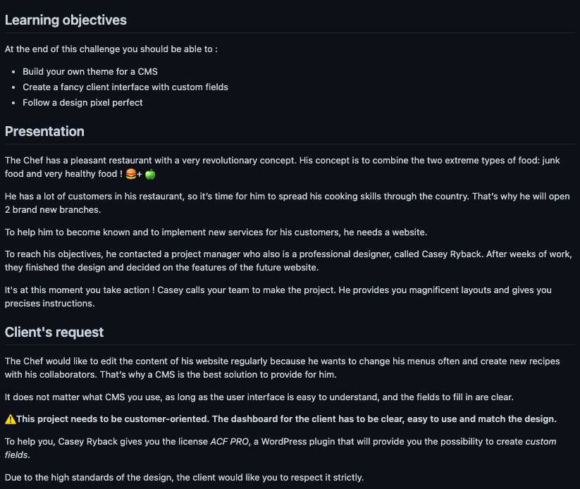

# Wordpress - Dev-restaurant 
Initiation à wordpress

## Cadre:
Cet exercice est effectué dans le cadre de la 19ième semaine de formation au centre de formation BECODE. 
Nous sommes en mai 2021.

## Technos utilisées:
* wordpress
* css

## Auteurs: 
[Julien Louis](https://github.com/julouis)

[Rekha Lambotte](https://github.com/RekhaLambotte)

## Instructions:

Délai: 3semaines

## Projet déployé: 
Lien Github : https://github.com/julouis/dev-restaurant

Lien web: http://dev-restaurant.byethost9.com
